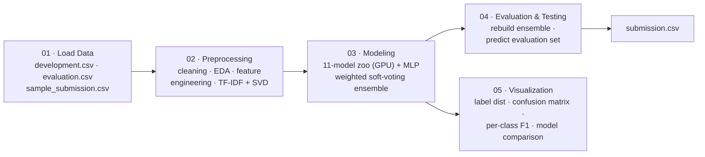

<div align="center">

# 📰 News Article Topic Classification

### Classifying ~100,000 international news articles into 7 topic categories from their text and metadata


</div>

<br>

> **TL;DR** — Given ~100,000 news articles from multiple international
> publishers — each with a title, full text, source, page rank, and
> publication timestamp — the goal is to predict which of **7 topic
> categories** an article belongs to. The solution is a 5-stage notebook
> pipeline: rich feature engineering (K-fold target-encoding, TF-IDF
> word+char n-grams compressed with chi²/SVD, text-style and time
> features), an **11-model GPU-accelerated zoo** plus a PyTorch MLP, and a
> validation-weighted **soft-voting ensemble** — all selected and scored on
> **Macro F1**, not accuracy.

<br>

## 📋 Contents

- [Overview](#-overview)
- [Dataset](#-dataset)
- [Task & Metric](#-task--metric)
- [Pipeline](#️-pipeline)
- [Approach](#-approach)
- [Model Zoo & Ensemble](#-model-zoo--ensemble)
- [Repository Structure](#-repository-structure)
- [Running It](#-running-it)
- [Submission Format](#-submission-format)
- [Tech Stack](#️-tech-stack)

<br>

## 🎯 Overview

<table>
<tr>
<td width="25%" valign="top"><b>🧩 Problem</b></td>
<td>Multi-class classification — which of 7 topics does a news article belong to?</td>
</tr>
<tr>
<td valign="top"><b>📦 Data</b></td>
<td>~100,000 articles from multiple international news sources — metadata (source, page rank, timestamp) + free text (title, full article)</td>
</tr>
<tr>
<td valign="top"><b>🏷️ Classes</b></td>
<td>7 topic categories: International News, Business, Technology, Entertainment, Sports, General News, Health</td>
</tr>
<tr>
<td valign="top"><b>🎯 Metric</b></td>
<td><b>Macro F1</b> — every category weighted equally regardless of how frequent it is</td>
</tr>
<tr>
<td valign="top"><b>🧠 Approach</b></td>
<td>Feature-engineered text + metadata → 11-model classical zoo (GPU-accelerated) + MLP → weighted soft-voting ensemble</td>
</tr>
<tr>
<td valign="top"><b>⚠️ Constraint</b></td>
<td>No external datasets allowed — only the provided data</td>
</tr>
</table>

<br>

## 📊 Dataset

Each row is a news article; the label is its topic category.

<table>
<tr><th align="left" colspan="2">📄 Metadata</th></tr>
<tr><td><code>id</code></td><td>Unique identifier of the article</td></tr>
<tr><td><code>source</code></td><td>News outlet / publisher</td></tr>
<tr><td><code>page_rank</code></td><td>Page rank associated with the article's source</td></tr>
<tr><td><code>timestamp</code></td><td>Date and time of publication</td></tr>
</table>

<table>
<tr><th align="left" colspan="2">✍️ Text content</th></tr>
<tr><td><code>title</code></td><td>Title of the news article</td></tr>
<tr><td><code>article</code></td><td>Full textual content of the article</td></tr>
</table>

<table>
<tr><th align="left" colspan="2">🎯 Target</th></tr>
<tr><td colspan="2"><code>label</code> — one of 7 categories:</td></tr>
<tr><td><code>0</code></td><td>International News</td></tr>
<tr><td><code>1</code></td><td>Business</td></tr>
<tr><td><code>2</code></td><td>Technology</td></tr>
<tr><td><code>3</code></td><td>Entertainment</td></tr>
<tr><td><code>4</code></td><td>Sports</td></tr>
<tr><td><code>5</code></td><td>General News</td></tr>
<tr><td><code>6</code></td><td>Health</td></tr>
</table>

> **Files** — `development.csv` (79,997 rows, has `label` — training/validation)
> · `evaluation.csv` (20,000 rows, no `label` — the final prediction target) ·
> `sample_submission.csv` (submission template).
>
> Articles come from **multiple publishers** and **span different
> publication dates** — both `source` and `timestamp` carry real signal and
> are engineered into features rather than dropped (see [Approach](#-approach)).

<br>

## 🏁 Task & Metric

Build a classification pipeline that predicts the topic label for every
article in the evaluation set, using its text and metadata. Since the model
is compared across 7 categories that aren't evenly represented, the
official evaluation metric is **Macro F1** — computed per class and
averaged unweighted, so a model can't hide poor performance on a rare
category behind strong performance on a common one. Every model in the zoo
is trained with `class_weight='balanced'` and selected/ranked on validation
Macro F1 for exactly that reason.

<br>

## 🗂️ Pipeline

Five notebooks, run in order, each reading the previous stage's pickled
artifact from `artifacts/` and writing its own:



<table>
<tr><td width="8%"><b>01</b></td><td><b>Load Data</b></td><td>Mounts Drive, reads the three raw CSVs, pickles them as-is for the rest of the pipeline.</td></tr>
<tr><td><b>02</b></td><td><b>Preprocessing</b></td><td>EDA-driven cleaning, feature engineering, TF-IDF vectorization, chi²/SVD compression, and encoding — produces the dense, GPU-ready train/validation/evaluation matrices.</td></tr>
<tr><td><b>03</b></td><td><b>Modeling</b></td><td>Hyperparameter tuning, an 11-model GPU-accelerated zoo plus a PyTorch MLP, and a validation-weighted soft-voting ensemble.</td></tr>
<tr><td><b>04</b></td><td><b>Evaluation & Testing</b></td><td>Reconstructs the exact same weighted ensemble and writes the final <code>submission.csv</code>.</td></tr>
<tr><td><b>05</b></td><td><b>Visualization</b></td><td>Label distribution, confusion matrix, per-class performance, and model-comparison charts for the report.</td></tr>
</table>

<br>

## 🧪 Approach

<details>
<summary><b>🧹 Cleaning</b></summary>
<br>

- Rows with a missing label or malformed nulls are **dropped** from
  train/validation; the evaluation set is **filled, not dropped** — every
  evaluation row must receive a prediction to match `sample_submission.csv`.
- Placeholder nulls (`\N`, `null`, `None`, empty string, `nan`) and
  infinities are normalized to real NaNs before handling.
- Exact `title` + `article` duplicates are removed from training only.
- Text fields are lowercased and stripped; `timestamp` is parsed to a real
  datetime.

</details>

<details>
<summary><b>🛠️ Feature engineering</b></summary>
<br>

- **Text length & style** — log-scaled title/article length, average word
  length, punctuation density, capitalization ratio, digit density.
- **Time features** — an hour-of-day bucket (morning/noon/afternoon/
  evening/night/midnight) and day-of-week extracted from `timestamp`.
- **`source` target-encoding** — K-fold out-of-fold multiclass
  target-encoding (`P(label = k | source)`, one column per class) instead
  of a raw one-hot, computed without leakage on train and applied once to
  validation/evaluation. Outlets specialize by topic, so this is the
  single richest engineered feature.
- **`page_rank` encoding** — automatically one-hot encoded if
  low-cardinality, or scaled as a numeric feature otherwise, decided from
  an EDA cardinality/skew check.

</details>

<details>
<summary><b>✍️ Text vectorization & dimensionality reduction</b></summary>
<br>

- **TF-IDF, word n-grams** (1–3) up to 30k features over `title` (repeated
  3×, since it's the article's own summary and carries proportionally more
  signal) concatenated with `article`.
- **TF-IDF, character n-grams** (3–5, `char_wb`) up to 20k features —
  catches stylistic/spelling patterns word n-grams miss.
- **Chi² feature selection** trims the combined ~50k-term matrix to the
  most class-informative 20k terms.
- **TruncatedSVD (LSA)** compresses that into a dense, scaled 500-dim
  block — this is what makes the text representation GPU-friendly for
  cuML KNN and the PyTorch MLP, and what lets it combine cleanly with the
  numeric/encoded feature block.

</details>

<br>

## 🧠 Model Zoo & Ensemble

Every model is restricted to the approved list, trained with
`class_weight='balanced'`, and GPU-accelerated via **RAPIDS cuML** where it
supports multiclass output (Logistic Regression, KNN, Random Forest,
GaussianNB); cuML's `MBSGDClassifier`/`SVC` are binary-only, so
`SGDClassifier` and both SVMs stay on CPU regardless of GPU availability.

<table>
<tr><th align="left">Family</th><th align="left">Models</th></tr>
<tr><td>Linear</td><td>Logistic Regression, LinearSVC, RidgeClassifier, SGDClassifier — top 3 tuned via <code>RandomizedSearchCV</code> on Macro F1</td></tr>
<tr><td>Trees / Ensembles</td><td>Decision Tree, Random Forest, Extra Trees, Gradient Boosting — depth-regularized after an initial run showed heavy overfitting</td></tr>
<tr><td>Other classical</td><td>Naive Bayes (GaussianNB), KNN, SVM (RBF, trained on a 15k-row subsample for tractability)</td></tr>
<tr><td>Deep learning</td><td>A small PyTorch MLP (256→128, dropout 0.3) trained on the TF-IDF/SVD block only, per spec</td></tr>
</table>

**Calibration** — Decision Tree and Extra Trees are wrapped in
`CalibratedClassifierCV`; LinearSVC and RidgeClassifier are fit once on a
train slice and calibrated with `cv='prefit'` on a held-out slice, so the
ensemble gets well-formed probabilities without diluting the decision
boundary across multiple undertrained sub-fits.

**Final ensemble** — a manual **soft-voting** average (not
`VotingClassifier`, since cuML/PyTorch objects aren't always
sklearn-clonable) of every model's predicted-class probabilities, each
weighted by its own validation Macro F1; models that barely beat random
guessing are dropped from the vote entirely.

<br>

## 📁 Repository Structure

```
.
├── 01_load_data.ipynb            # Read raw CSVs from Drive → artifacts/01_load_data.pkl
├── 02_preprocessing.ipynb        # Cleaning, EDA, feature engineering, TF-IDF+SVD
├── 03_modeling.ipynb             # 11-model zoo + MLP + weighted voting ensemble
├── 04_evaluation_testing.ipynb   # Rebuild ensemble → submission.csv
├── 05_visualization.ipynb        # Report charts (confusion matrix, per-class F1, ...)
└── README.md
```

<br>

## 🚀 Running It

The pipeline is built for **Google Colab** with the dataset in Google
Drive (`drive.mount`), and auto-detects a **RAPIDS cuML** GPU runtime,
falling back to plain scikit-learn on CPU if none is available.

1. Place `development.csv`, `evaluation.csv`, `sample_submission.csv` under
   `.../Projects/DSL/News Classification/DB/` in your Drive.
2. Run the notebooks **in order, 01 → 05** — each one reads the previous
   stage's pickle from `artifacts/` and writes its own.
3. `04_evaluation_testing.ipynb` produces the final `submission.csv`, ready
   for upload to the DSLE platform.

<br>

## 📬 Submission Format

Results are uploaded to the course's DSLE platform as a CSV with a header
and one row per evaluation record:

```
Id,Predicted
0,0
1,2
2,5
3,4
...
```

<br>

## 🛠️ Tech Stack


<br>

---

<div align="center">
<sub>Data Science and Machine Learning Lab, Politecnico di Torino — Project Assignment, Winter Call, A.Y. 2025/2026.</sub>
</div>

